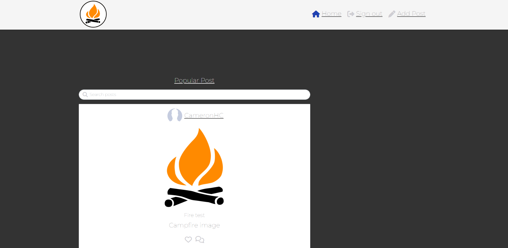
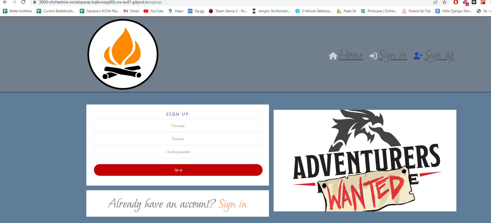

# Social Space
 
The Social Space is designed to be where users can make posts and reviews about TV Shows, Games, Boardgames and other things they like and then search for those by tags. They can also make a profile and detail it with a bio and profile picture.

## Features 

### Existing Features

- __Navigation Bar__

  There's a nav bar at the top of the screen to got to the different screens, so from here you can go to the homepage, sign in and sign out and they can also make posts and reviews when signed in. 

- __The posts__

  Users will be able to make posts whereby they will fill out a form. This form will allow them to type out the body of their post, title it, add an image and add a tag to it as well. This tag is used to search for different posts and differeniate them from posts about different things.

- __Login Page__
  This is where users who have made an account can sign in and from there they can create posts and reviews, edit their profile and comment on posts and reviews as well.
 

- __Register page__

  Before the user can login, they must register and sign up to the website. They will have to enter a username and secure password. 

- __Logout__

  If the user wants, they also have the option to sign out of their account too.

- __A Blog Post__

  So here is a blog post itself: The title and image are held within a masthead at the top and the body of the blog itself is below. If an image wasn't selected, it would default to a standard image.

- __Review__ 

  A review is set up very similarly to the blog post but asks for different information. It requires the user to put in a rating out of 10 for the thing they're reviewing.

-__Comment__

  A user can comment on a post which they can also edit afterwards. Only user who made their own comments can edit and delete them. 

-__Edit Profile__

  Here is where the user can edit their profile if they so wish, changing the image and their name. 

## Testing 

 So this program does have a major issue in that users can't sign in. This sadly breaks the project all together and is why I have pictures of the API posts rather than the actual posts on the app. I have tried for over 10 hours to fix this bug and have had two four hour sessions with tutor support to try and fix this but no joy. It looks to be that this error stems from the settings.py file in my Django API however where exactly is unclear. I have added several different things to that file but nothing seems to be working. The error that appears was a CORS error, when the API is blocked as it sees it as a dangerous URL essentially and blocks communication between the two. In order to get around this, I have tried many things: I have edit the config vars on Heroku, made sure I've got everything installed and set up properly in the settings.py file. I have also tried removing the 'CLIENT_ORIGIN' on Heroku which got me a different error but an error nonetheless. 

As mentioned, this is sadly project breaking; If users can't sign in, they can't interact with the website in anyway. I can only say that everything should work in theory however that clearly isn't the case. 

I was able to fix the above issue eventually as the issue stemmed from the index.js file. This file did not contain the CurrentUserProvider which was stopping users from signing in. Once this was added, users can now create posts, make comments and edit them as well. 

There are sadly still some issues with the project; The user profile, once made, is not editable and the reviews section was not made due to time constraints and bugs. With regards to the users profile, I wanted to to strip away the followers, likes and posts from the walkthrough. Although this is less functionality, I wanted it to be different and the user could still edit their profile such as username and password. However I was struggling to get this to work and sadly ran out of time for this. 

The same goes for the reviews, I wanted to add them in and have their own feed for them. However the feed wasn't working and was erroring which I also was not able to finish due to time constraints. 

With the comments, there were some issues with those at first as the API wasn't speaking properly with the front end and was generating a 500 error. This was resolved due to me forgetting to add the 'id' field in the PostSerializer on the API. Once this was added, the users can now post comments. The image field was also acting for a similar reason and I had to rename the places where the front end called 'image' for 'featured_image'. Once this was resolved, the users can now add images and display them on the posts. 

Other forms of testing I've done is made sure that things scale down for mobile users which it does thanks to Bootstrap. The website pages that are available scale down to mobile views nicely and are easily accessible on different screen sizes as well. 

Following in on from the feedback I had gotten, I had changed the font on the sign in page as well as some of the colors on the page to help users see things more clearly. 

## Data Models 

  I had several data models for this project: Post, Reviews and Profile. 

  Post: This data model was used for actually making the posts on the website itself; It consists of a Title, Content, Profile_id of the author, a Featured Image and the Post Tag. It also captures who the author for authentication purposes and when the post was created and last updated. This all allows the author to put on to the post all the information needed as well them and only them being able to edit their posts. This is so that random users can't hop on and edit other people's post. 

  

  Reviews: Reviews are similar to posts but have difference in their data model and intended user. These contain the Author, Title, Content, a Post Tag and a Review Score as well. These also hold the data for when it was created and when it was last updated as well. These also have the safety feature of only allowing the author to edit them. 

  

  Profile: This data model allows users to create profiles, attaching a profile picture and a bio to it as well. 

  

 ### Agile methodology

 For the Agile Methodology, I used the project board on github to plan out my project. For this, I had selected issues and moved them across to the corresponding column when they either being started, worked on or had been completed. I marked each of these as issues and also added comments to them were appropriate as well. Once these were added to the done section, I would mark these issues as closed as well. 

 

 ### UX Design

 For the UX design, I had taken a similar approach to what was on the walkthrough and what I had done on my previous project, Project Blog. I wanted a minimalist design to it; a navbar at the top that the user can use to navigate around the website and the main bulk of the website content in the middle of screen. This keeps what's important, the posts, in the main field of view of the user and also doesn't clutter up the screen either. As this was taking inspiration from work I had done before, I hadn't taken any designs of this work. I simply tried to emulate the designs I had done before as I knew that they were good design practices. 

### Validator Testing 

  Code Validation:
  To ensure all code for Gamernetic was correct, validation through various validators was performed. The results are listed below.

  HTML:
  Homepage: 

  

  Login:

  

  Sign-up:

   

   CSS:

   

  Python: 

  As of me testing this, the PEP8 validator is currently down so I am unable to validate my code throughout. As a workaround, I will use pycodestyle instead using the following method:

  Run the command pip3 install pycodestyle  Note that this extension may already be installed, in which case this command will do nothing.

  In your workspace, press Ctrl+Shift+P (or Cmd+Shift+P on Mac).

  Type the word linter into the search bar that appears, and click on Python: Select Linter from the filtered results (image 1).

  Select pycodestyle from the list (image 2).

  PEP8 errors will now be underlined in red, as well as being listed in the PROBLEMS tab beside your terminal.

  Using this method, here were the results from my validator testing: 

  Validation of API: 

  

  Browser Testing:

  My website successfully loads on Edge, Chrome and Firefox. 

  
  
  

### Languages
   - Python
   - JavaScript
   - HTML5
   - CSS3

### Frameworks, Libraries, Programs
- Python Built-in Modules:
  - [os](https://docs.python.org/3/library/os.html) 

- External Packages
  - [cloudinary](https://pypi.org/project/cloudinary/1.29.0/) 
  - [crispy-bootstrap5](https://pypi.org/project/crispy-bootstrap5/0.6/) 
  - [dj-database-url](https://pypi.org/project/dj-database-url/0.5.0/) 
  - [dj3-cloudinary-storage](https://pypi.org/project/dj3-cloudinary-storage/0.0.6/) 
  - [Django](https://pypi.org/project/Django/3.2.14/) 
  - [django-allauth](https://pypi.org/project/django-allauth/0.51.0/)
  - [django-crispy-forms](https://pypi.org/project/django-crispy-forms/1.14.0/) 
  - [gunicorn](https://pypi.org/project/gunicorn/20.1.0/)
  - [psycopg2](https://pypi.org/project/psycopg2/2.9.3/) 
  - [react] (https://reactjs.org/)
  - [react-moment] (https://www.npmjs.com/package/react-moment)
  - [react-bootstrap] (https://www.npmjs.com/package/react-bootstrap)
  - [axios] (https://www.npmjs.com/package/axios)
  - [react-moment] (https://www.npmjs.com/package/react-moment)
  - [react-infinite-scroll-component] (https://www.npmjs.com/package/react-infinite-scroll-component)
  - [sqlparse] (https://pypi.org/project/sqlparse/)
  - [cryptography] (https://pypi.org/project/cryptography/)
  - [django-rest-framework] (https://www.django-rest-framework.org/)
  - [PyJWT] (https://pypi.org/project/PyJWT/)
  - [dj-rest-auth] (https://pypi.org/project/dj-rest-auth/)
  - [django-allauth] (https://pypi.org/project/django-allauth/)
  - [django-cors-headers] (https://pypi.org/project/django-cors-headers/)
  - [django-filter] (https://pypi.org/project/django-filter/)
  - [Pillow] (https://pypi.org/project/Pillow/)
  - [oauthlib] (https://pypi.org/project/oauthlib/)
  - [python3-openid] (https://pypi.org/project/python3-openid/)
  - [pytz] (https://pypi.org/project/pytz/)
  
 
### Programs & Tools

- [Google Fonts:](https://fonts.google.com/)
  - Was used to to incorporate font styles.  
- [Bootstrap](https://getbootstrap.com/)
  - Was used to create the front-end design.
- [GitPod:](https://gitpod.io/)
  - Gitpod was used as IDE to commit and push the project to GitHub.
- [GitHub:](https://github.com/)
  - Was used for all storing and backup of the code pertaining to the project.
  ## Deployment

### Forking the GitHub Repository
1. Go to [the project repository](hhttps://github.com/CHCheshire/social-space-js)
2. In the right most top menu, click the "Fork" button.
3. There will now be a copy of the repository in your own GitHub account.

### Running the project locally
1. Go to [the project repository](https://github.com/CHCheshire/social-space-js)
2. Click on the "Code" button.
3. Choose one of the three options (HTTPS, SSH or GitHub CLI) and then click copy.
4. Open the terminal in you IDE program. 
5. Type `git clone` and paste the URL that was copied in step 3.
6. Press Enter and the local clone will be created. 

### Alternatively by using Gitpod:
1. Go to [the project repository](https://github.com/CHCheshire/social-space-js)
2. Click the green button that says "Gitpod" and the project will now open up in Gitpod.

### Deploying with Heroku

I followed the below steps using the Code Institute tutorial:

The following command in the Gitpod CLI will create the relevant files needed for Heroku to install your project dependencies `pip3 freeze --local > requirements.txt`. Please note this file should be added to a .gitignore file to prevent the file from being committed.

1. Go to [Heroku.com](https://dashboard.heroku.com/apps) and log in; if you do not already have an account then you will need to create one.
2. Click the `New` dropdown and select `Create New App`.
3. Enter a name for your new project, all Heroku apps need to have a unique name, you will be prompted if you need to change it.
4. Select the region you are working in.

#### Heroku Settings  
You will need to set your Environment Variables - this is a key step to ensuring your application is deployed properly.
1. In the Settings tab, click on `Reveal Config Vars` and set the following variables:
    - Add key: `PORT` & value `8000`
    - Add key: DATABASE_URL, this should have been created automatically by Heroku.
    - Add key: CLOUDINARY_URL and the value as your cloudinary API Environment variable e.g.
    - Add key: SECRET_KEY and the value as a complex string which will be used to provide cryptographic signing.

2. Buildpacks are also required for proper deployment, simply click `Add buildpack` and search for the ones that you require.
    - For this project, I needed to add `Python`.

####  Heroku Deployment  
In the Deploy tab:
1. Connect your Heroku account to your Github Repository following these steps:
    - Click on the `Deploy` tab and choose `Github-Connect to Github`.
    - Enter the GitHub repository name and click on `Search`.
    - Choose the correct repository for your application and click on `Connect`.
2. You can then choose to deploy the project manually or automatically, automatic deployment will generate a new application every time you push a change to Github, whereas manual deployment requires you to push the `Deploy Branch` button whenever you want a change made.
3. Once you have chosen your deployment method and have clicked `Deploy Branch` your application will be built and you should now see the `View` button, click this to open your application.

### Credits 

Thanks to Adam Lapinski for the Moments and Rest Framework guides. Would also like to thank Gemma and Jason for trying to help me with the Sign In issues with my project as well. 

### Media

Logo in the top left hand corner: (https://library.kissclipart.com/20180915/kfw/kissclipart-bonfire-clipart-campfire-bonfire-clip-art-32cc703488dbc689.jpg)

Adventures wanted logo: (https://scontent.fltn3-1.fna.fbcdn.net/v/t1.6435-9/58717903_307655179902328_5817799846886637568_n.png?stp=dst-png_p180x540&_nc_cat=103&ccb=1-7&_nc_sid=730e14&_nc_ohc=eBe5sIc51IkAX_4dCwT&_nc_ht=scontent.fltn3-1.fna&oh=00_AfCA-7iYcakmQMWgo3tS9QoGord1w6RbPxXYKbNUvATPng&oe=63E2A628)